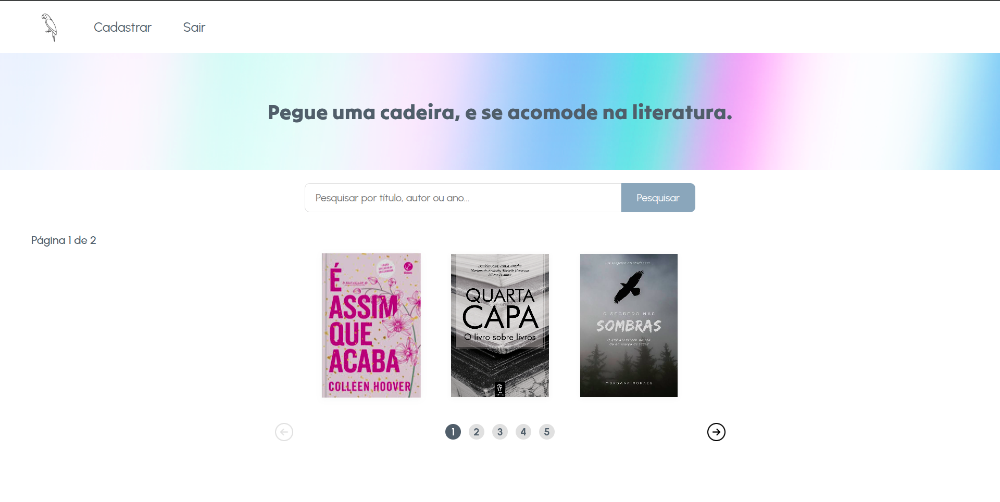
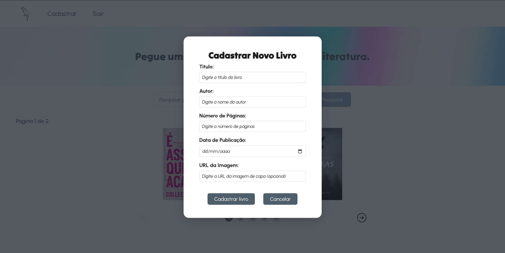
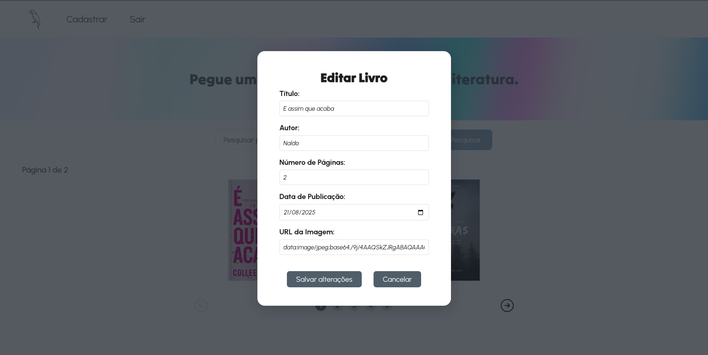

# Arararquivos - Sistema de Gerenciamento de Biblioteca

Sistema de gerenciamento de biblioteca desenvolvido para a disciplina de Sistemas Distribuídos. Este projeto consiste em uma aplicação web que permite aos usuários cadastrar, visualizar, editar e excluir registros de livros.

Link da apresentação no Youtube: www.youtube.com/watch?si=uRPR8Fz3Kx6z1k7_&v=sGoLqJawxeY&feature=youtu.be

## 📋 Requisitos

### Backend
- Node.js (v14.0 ou superior)
- NPM ou Yarn

### Frontend
- Node.js (v14.0 ou superior)
- NPM ou Yarn
- Vue 3

### Banco de dados
- O projeto utiliza Supabase como banco de dados na nuvem
- É necessário ter uma conta no Supabase e configurar as credenciais

## 🚀 Como executar

### Configuração do Banco de Dados

1. Crie uma conta no [Supabase](https://supabase.com/)
2. Crie um novo projeto
3. Crie uma nova tabela chamada `book` com os seguintes campos:
   - `id` (int, primary key, auto increment)
   - `title` (varchar)
   - `author` (varchar)
   - `number_of_pages` (int)
   - `year_of_publication` (date)
   - `image_url` (varchar, optional)

4. Habilite a autenticação por email/senha nas configurações do projeto

### Configuração do Backend

1. Navegue até a pasta do servidor:
```bash
cd server
```

2. Crie um arquivo `.env` na raiz do diretório `server` com as seguintes variáveis:
```
SUPABASE_URL=sua_url_do_supabase
SUPABASE_KEY=sua_chave_anon_key_do_supabase
```

3. Instale as dependências:
```bash
npm install
```

4. Inicie o servidor:
```bash
npm start
```

O servidor estará rodando em `http://localhost:3000`

### Configuração do Frontend

1. Navegue até a pasta do cliente:
```bash
cd client
```

2. Instale as dependências:
```bash
npm install
```

3. Inicie o servidor de desenvolvimento:
```bash
npm run dev
```

O cliente estará rodando em `http://localhost:5173` (ou na porta que o Vite indicar)

## 🔍 Funcionalidades

- **Autenticação de usuários**: Cadastro e login
- **Gerenciamento de livros**: Cadastro, visualização, edição e exclusão
- **Pesquisa**: Busca de livros por título, autor ou ano de publicação

## 📱 Capturas de Tela

### Tela de Login


*Descrição: Página de login onde os usuários podem inserir suas credenciais para acessar o sistema.*

### Tela de Cadastro de Usuários


*Descrição: Página onde novos usuários podem se registrar no sistema.*

### Dashboard / Home



*Descrição: Página principal onde os livros cadastrados são exibidos e o usuário pode interagir com eles.*

### Modal de Cadastro de Livro



*Descrição: Modal para adicionar um novo livro ao sistema.*

### Modal de Detalhes do Livro


*Descrição: Modal que exibe informações detalhadas de um livro selecionado.*

### Modal de Edição de Livro



*Descrição: Modal para editar as informações de um livro existente.*

### Modal de Confirmação de Exclusão


*Descrição: Modal para confirmar a exclusão de um livro.*

## 🔧 Tecnologias utilizadas

- **Frontend**: Vue.js 3, HTML5, CSS3
- **Backend**: Node.js, Express
- **Banco de dados**: Supabase
- **Autenticação**: Supabase Auth

## 👥 Contribuidores

- Francinaldo de Sousa Barbosa - Desenvolvedor
- Iago Roberto Esmerio Almeida - Desenvolvedor
- Cristina de Moura Sousa - Desenvolvedora


